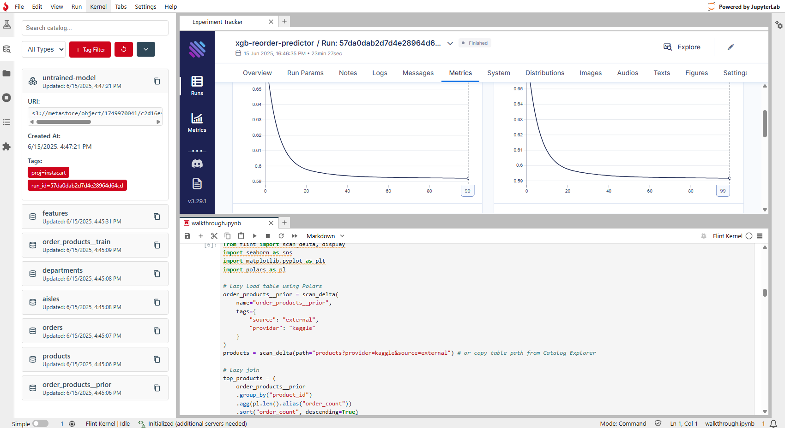

<div align="center">
  <!-- Logo -->
  <br/>

  <!-- Badges, all inside the same HTML block -->
  
  

  </br>
</div>

<br>

**FlintML** is the all-in-one, self-hosted ML platform for real-world teams. Simple, flexible, fast to deploy, and built for people solving actual problems—not chasing hype.

<div align="center">
  <br/>
</div>

## 🚀 Quickstart

```bash
curl -sL https://raw.githubusercontent.com/flintml/flint/main/flintml-quickstart.sh | bash
```

FlintML will become available at `localhost:8701`. The first time you execute code may take a couple of minutes while FlintML downloads the relevant worker image.

**Note:** ensure Docker is installed and you are on a Linux (or WSL) machine (ARM currently not supported.)

##  Why FlintML?

FlintML enables teams to deliver end-to-end ML quickly and with minimal infrastructure overhead. With FlintML, all key components of the MLOps process are centralised, providing an integrated and developer-centric experience.

**Core features:**
-  **[Delta Lake](https://github.com/delta-io/delta) storage layer** – adds ACID guarantees and time travel to your data pipelines with scalable, versioned storage.
-  **Unified data catalog** – tables, models, artefacts, and any other file types are treated as first-class data citizens.
-  **Efficient data processing with [Polars](https://github.com/pola-rs/polars)** – leverage lazy execution for memory-efficient data operations.

**Integrated tools:**
-  **Experiment tracking with [Aim](https://github.com/aimhubio/aim)** – run experiments and compare them all in one place.
-  **Familiar notebook development environment** – all functions are seamlessly integrated with Jupyter Lab.
-  **Workflow orchestration via [Dagster](https://github.com/dagster-io/dagster) (WIP\*)** – load data, retrain models, and run inference on a schedule.

**Platform & Deployment:**
-  **Flexible and reproducible compute** – switch between compute [drivers](docs/concepts.md#drivers) to fit your use case, or write your own.
-  **Composable, declarative infrastructure** – have full control over your Docker Compose deployment.

## 🔎 Demo

To get a sense of what you can do with FlintML, check out the [Instacart Kaggle example](examples/instacart.ipynb). You can also read about FlintML [concepts](docs/concepts.md) and check out the [reference](docs/reference.md) to learn more about the platform's capabilities

## ⚙️ Customising Your Deployment

### Data Storage

FlintML ships with its own [Storage](docs/concepts.md#flint-control-plane) service that depends on the mounts, `storage_data` and `storage_meta`. If you wish to specify custom volumes, you should create an override `docker-compose.override.yml` and compose it when spinning up flint. See the [docs](https://docs.docker.com/compose/how-tos/multiple-compose-files/merge/).

### Environment Variables

#### `FLINT_PORT`

Defines the port number at which the FlintML platform will be served.

Default of `8701`.

#### `STORAGE_USER` and `STORAGE_PASSWORD`.

These environment variables define the login credentials that [Worker Containers](docs/concepts.md#worker-containers) and services in the [Flint Control Plane](docs/concepts.md#flint-control-plane) use to authenticate to the [Flint Catalog](docs/concepts.md#flint-catalog).

Defaults are `admin` and `password` respectively.

#### `DRIVER_CONFIG`

This must be the file path to the desired [Worker Configuration](#worker-configuration).

No default. See [example](src/.env.example) env file.

#### `DOCKER_SOCKET`

FlintML uses [Worker Containers](docs/concepts.md#worker-containers) to execute code and run jobs. These containers are orchestrated by the configured driver. If the [Local Driver](docs/concepts.md#local-driver) is selected, the Docker socket must be mounted to the Compute Manager service in the [Flint Control Plane](docs/concepts.md#flint-control-plane).

Since mounting the Docker socket has security implications, the default value for this environment variable is `/dev/null`, meaning that the Docker socket IS NOT mounted.

The [quickstart](#quickstart) uses the Local Driver for simplicity and thus mounts the docker socket. See [example](src/.env.example) env file.

### Worker Configuration

To see the full worker specificaton, see the [schema](src/compute-manager/worker-config-schema.json). Some example configurations are provided below.

[Local Driver](docs/concepts.md#local-driver) with mounted NAS volume:

```yaml
driver:
  type: local
  image: flintml/worker-base:latest
  mounts:
    # <mount_name>: <host_mount_point>
    image-data: /mnt/nas/images # Will be available at `/mnt/image-data` inside worker container.
```

To customise compute environments, you will need to use a [custom image](docs/concepts.md#custom-images).

### Building Locally

All FlintML codefiles live under `src/`. You will see two sets of Compose, env and worker config files - `build` and `release-template`. `release-template` files are used to define the release tarball and thus can be ignored for local development. 

To build locally, you must firstly build the base worker image so it exists in your local Docker registry:

```bash
docker build -f ./src/worker-base/Dockerfile -t worker-base:latest ./src/
```

Then you can spin up the platform by using the `build` files:

```bash
docker compose -f ./src/docker-compose.build.yml --env-file ./src/.env.build up
```

**Note:** If you update the dependencies of any packages in `src/common-lib`, make sure you run `./update-common-lib.sh` to update dependant Poetry lock files.

## 🎯 Roadmap

1. Workflows (in-progress)
2. Data upload support (can be achieved by defining a worker mount but is inconvenient)
2. Libcloud driver
3. Multi-user support

## 🤝 Contributing

We would be stoked for you to get involved with FlintML development! If you'd like to get more involved, please contact us at contact@flintml.com.

- 💬 [Start a discussion](https://github.com/bosonstack/boson/discussions)
- 🛠️ [Fix a bug](https://github.com/bosonstack/boson/issues/new)
- 🧠 [Request a feature](https://github.com/bosonstack/boson/issues/new)