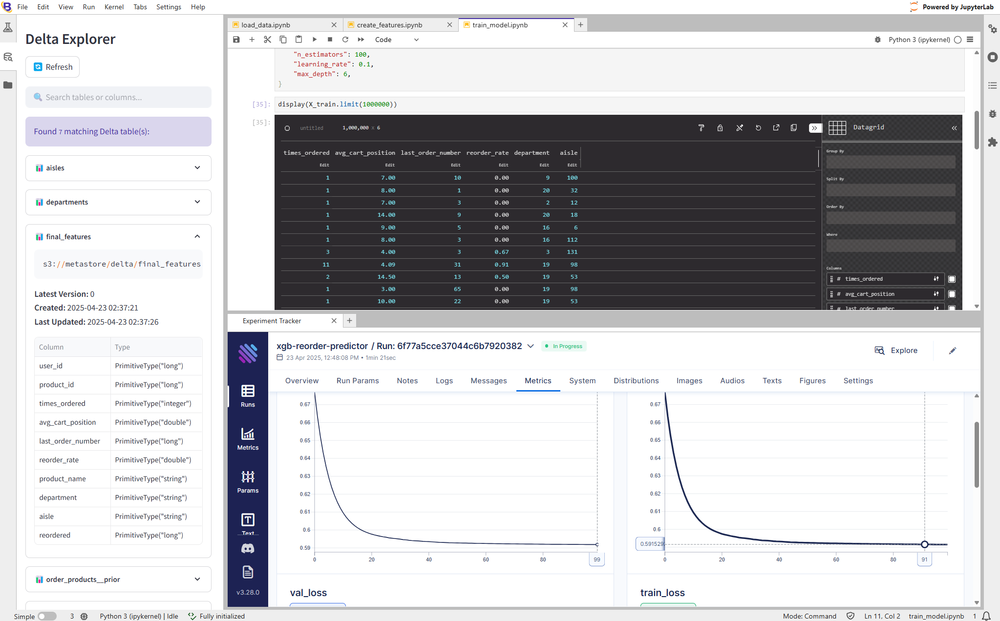
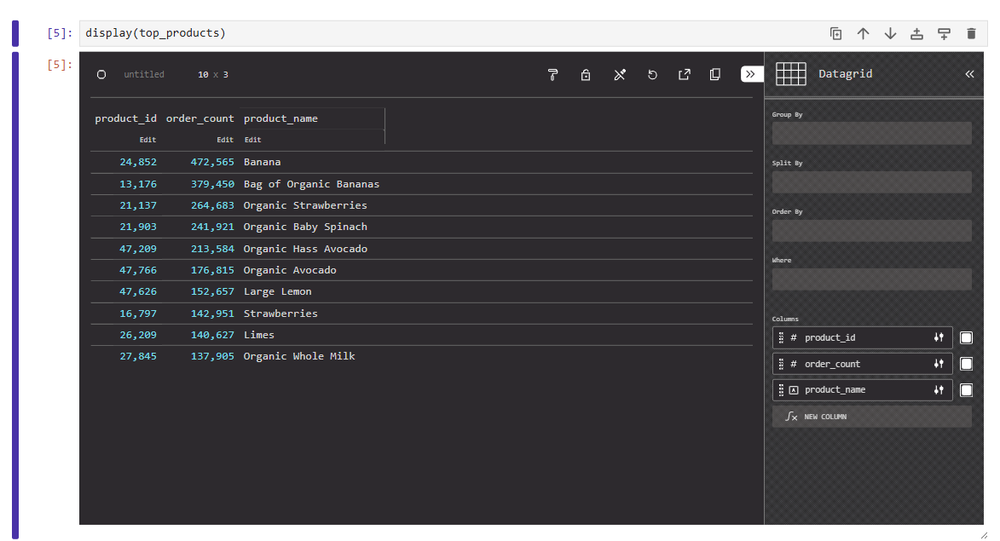
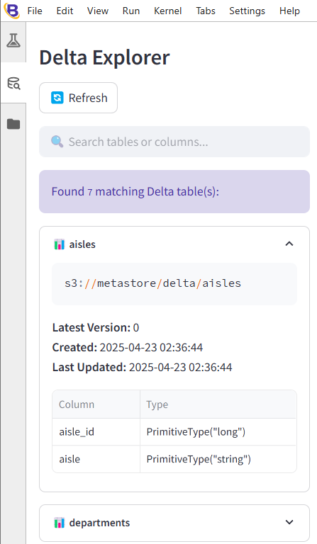

# Boson

**Boson** is a lightweight, fully containerized, and feature-rich machine learning research platform. It centralizes essential tools to help teams keep projects lean, organized, and reproducible—while reducing overhead and boosting productivity. Think Databricks/Sagemaker but local and free.

Boson enables engineers and researchers to iterate faster without getting bogged down by infrastructure or tooling complexity.



---

## Contents
- [Key Features](#-key-features)
- [Quickstart](#-quickstart)
- [Quick Look](#-quick-look)
- [Creating a Workspace](#-creating-a-workspace)
- Documentation
  - [Example - Instacart](docs/example-instacart.md)
  - [Concepts](docs/concepts.md)
  - [Builtins](docs/builtins.md)
- [Contributing](#-contributing)

## 🔑 Key Features

- **Out-of-the-Box Data Lake Integration**  
  Boson uses [Delta Lake](https://github.com/delta-io/delta) to store datasets and features, making it easy to save and load dataframes as versioned tables. A built-in Delta Explorer lets you visually inspect your lake in real time.

- **Lazy Data Processing with Polars**  
  Boson supports efficient, memory-conscious data workflows using [Polars](https://github.com/pola-rs/polars). This makes large, expensive transformations performant and scalable—even on local hardware.

- **Integrated Experiment Tracking**  
  Powered by [Aim](https://github.com/aimhubio/aim) Boson offers a seamless tracking experience—log metrics, compare experiments, and visualize performance over time with zero setup.

- **Cloud-Like Notebook Development**  
  All data, notebooks, artifacts, and metrics are stored in internal cloud storage. This keeps your local environment clean and every workspace fully self-contained.

- **Composable, Declarative Infrastructure**  
  Built on layered Docker Compose files, Boson enables isolated, customizable workspaces per project—without sacrificing reproducibility or maintainability.

---

## 🚀 Quickstart 

**Boson currently only supports AMD64 (i.e. no Mac). ARM support is a high priority.**

Boson requires that `docker` be installed.

After cloning, navigate to the project root and run:

```bash
docker compose -f docker-compose.base.yml -f workspaces/example-instacart/docker-compose.override.yml --env-file workspaces/example-instacart/.env up
```

This will spin up the `example-instacart` workspace. You can open this workspace in Boson by visitng `http://localhost:8889` in your browser.

Follow the [walkthrough](/docs/example-instacart.md) of this example.

## 🔎 Quick Look

Write Polars df to Delta Table:
```python
write_delta(my_df, "my_table_name")
```

Read Delta Table to Polars df:
```python
df_materialised = read_delta("my_table_name")
df_lazy = scan_delta("my_table_name")
```

Display inline Polars df:
```python
display(my_df)
```


Create Aim experiment for tracking:
```python
run = new_run(experiment="my-experiment-name")
```

View Delta Tables:



## ⚙️ Creating a Workspace
Boson is deployed by instantiating a *workspace*. A *workspace* is an instance of the **Boson Kernel** but with its own isolated dependencies and configuration.

The below instructions will create a new custom workspace with isolated storage.

Create a workspace by running:

```bash
./create-workspace.sh <MY_WORKSPACE_NAME> <MY_WORKSPACE_PORT>
```

Navigate to the workspace directory with:

```bash
cd workspaces/<MY_WORKSPACE_NAME>
```

Change Python dependencies via [Poetry](https://python-poetry.org/), for example:

```bash
poetry remove xgboost
poetry add plotly
```

If you do not have Poetry installed, you can follow the above link to set it up or manually update the `[tool.poetry.dependencies]` section of the `pyproject.toml`.

Spin up the Boson workspace with:

```bash
docker compose -f docker-compose.base.yml -f workspaces/<MY_WORKSPACE_NAME>/docker-compose.override.yml --env-file workspaces/<MY_WORKSPACE_NAME>/.env up
```

## 🤝 Contributing

We would be stoked for you to get involved with Boson development! If you'd like to get more involved, please contact Harry at harry@myntlabs.io.

- 💬 [Start a discussion](https://github.com/bosonstack/boson/discussions)
- 🛠️ [Fix a bug](https://github.com/bosonstack/boson/issues/new)
- 🧠 [Request a feature](https://github.com/bosonstack/boson/issues/new)

### Future tickets

- ARM support
- Improve linting - especially of custom builtins
- Introduce table schemas/scoping
- Nice CLI wrapper
- Various UI improvements