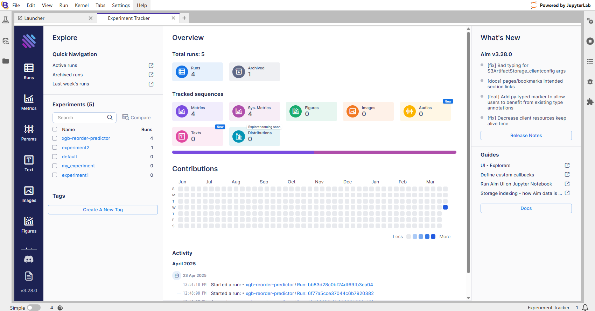
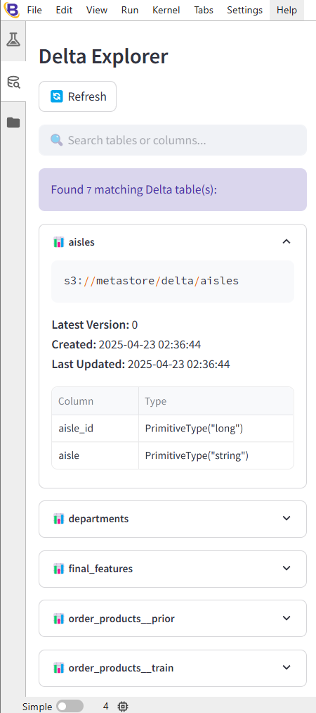

# Concepts

## Architecture

The Boson platform is a single-node-optimized, lightweight ML research platform that achieves fast, reproducible experimentation by separating concerns across a modular data and compute plane. It is designed to simplify the ML research lifecycle without the operational overhead of distributed systems and can be self-hosted.

### Core Architectural Principles

**Data Plane (Storage + Versioning)**
- Built on Delta Lake for ACID-compliant, versioned datasets
- Enables reproducible data access across experiments
- **Boson Metastore** (internal blob cloud storage) contains Delta Lake, notebooks and all local files
- Metastore is mounted to local Compute Plane location for seamless compute access

**Compute Plane (Experiment and Pipeline Execution)**
- Fully containerized execution via Docker Compose
- Optimized for single-node environments using Polars for ultra-fast data pipeline execution
- Notebook development environment 

## Workspaces
Boson achieves multi-tenancy through the use of a composable service architecture (with Docker Compose.) The **Boson kernel** is the base image used across all tenants and is preinstalled with common dependencies and integration logic. The kernel cannot be spun up by itself and instead, needs to be *instanced* with an overriding workspace Docker Compose file.

This standardises the developer experience and abstracts away architectural and platform overhead, while allowing for full workspace isolation, including:
- Independent Docker volumes
- Independent Python dependencies 
- Tailored compute allocations
- Independent environment variables
- Individually deployable workspaces

### Analysing Example - Instacart Workspace

A workspace installs the **Boson Kernel**, its own Python dependencies and sets up any additional configuration defined it its Docker Compose file. A workspace is defined by a subfolder of `workspaces/`. The contents of this folder are copied into the workspace container during Docker build-time. In this instance, the workspace is defined at, `workspaces/example-instacart/`. 

This workspace has three files:

#### `docker-compose.override.yml`

**Mandatory** - a workspace overrides the base stack.

```yml
version: "3.8"

services:
  storage:
    volumes:
      - example_instacart_storage_data:/usr/src/app/localData
      - example_instacart_storage_meta:/usr/src/app/localMetadata

  workspace:
    build:
      context: ./workspaces/example-instacart
      args:
        WORKSPACE_NAME: "Example - Instacart"
    volumes:
      - example_instacart_aim_data:/aim-repo

  aim-init:
    volumes:
      - example_instacart_aim_data:/repo

  aim-ui:
    volumes:
      - example_instacart_aim_data:/repo

volumes:
  example_instacart_storage_data: 
  example_instacart_storage_meta:
  example_instacart_aim_data:
```

These overrides ensure that this workspace has its own Docker volumes for data isolation.

#### `pyproject.toml`

**Mandatory** - a workspace must define a Python project.

```toml
[tool.poetry]
name = "example-instacart"
version = "0.1.0"
description = "Example - Instacart"
authors = ["Harry harry@myntlabs.io"]

[tool.poetry.dependencies]
python = "^3.12"
seaborn = "^0.13.2"
pandas = "^2.2.2"
xgboost = "^3.0.0"
scikit-learn = "^1.6.1"

[build-system]
requires = ["poetry-core"]
build-backend = "poetry.core.masonry.api"
```

The Python project file defines its dependencies.

#### `.env`

Boson must be provided a `.env` file with the below environment variables, but it does not have to be scoped to a workspace.

```.env
STORAGE_USER=admin
STORAGE_PASSWORD=password
BOSON_PORT=8889
```

Please ensure that the `BOSON_PORT` differs from any other workspaces currently running. `STORAGE_USER` and `STORAGE_PASSWORD` are only used by internal services but can be configured.

## Modular Components

### Aim Experiment Tracking

Boson incorporates [Aim](https://github.com/aimhubio/aim) for model experiment tracking. Aim is a powerful yet simple mechanism to track metrics, store configuration, monitor performance and log artifacts during ML research and development. Please refer to the Aim docs for usage instructions.

To instantiate an Aim run, refer to the built in [new_run](builtins#new_runargs-kwargs---run) function.

The Aim UI can be accessed clicking on the first button (conical flask icon) in the left sidebar:


Clicking this button will open up the Aim UI in a new JupyterLab tab:



### Delta Explorer

The Delta Explorer is a Boson Tool that constantly scans the internal Delta Lake for Delta Tables, retrieves associated metadata and visually displays these tables - avoiding the need to manually query the Delta Lake constantly during development.

The Delta Explorer can be opened by clicking on the second button (database search icon) in the left sidebar:

