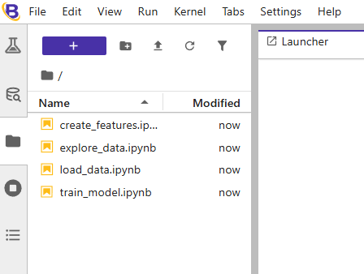
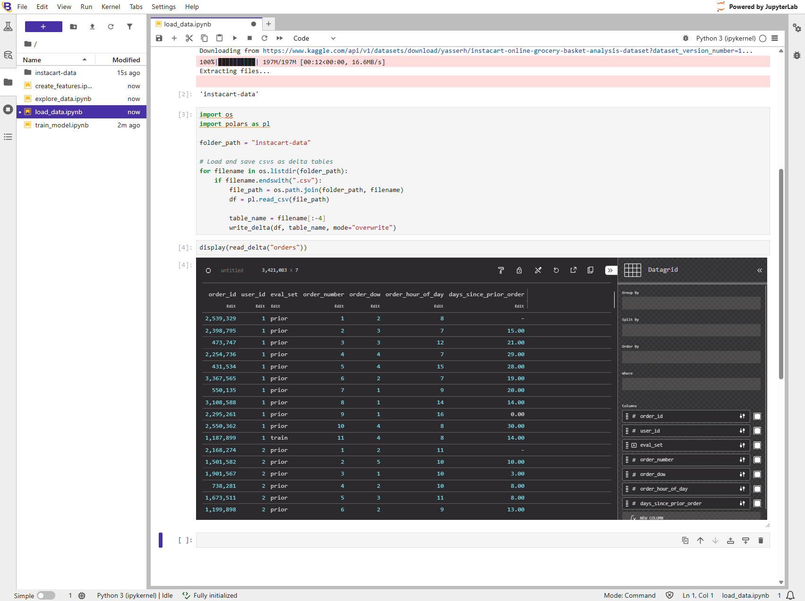
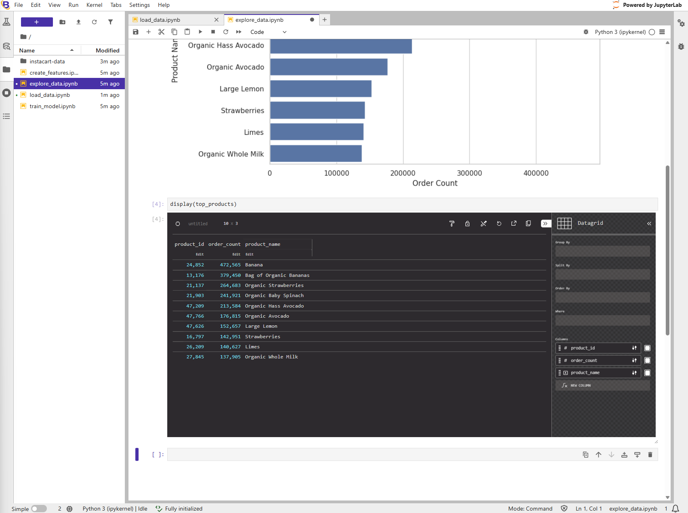
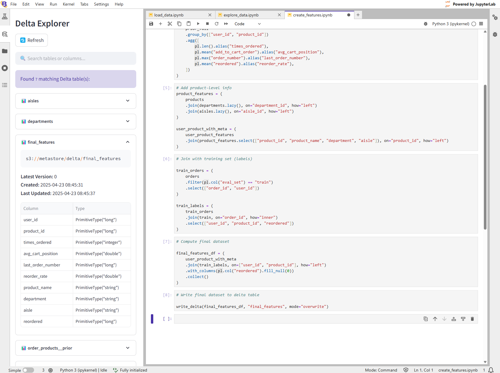
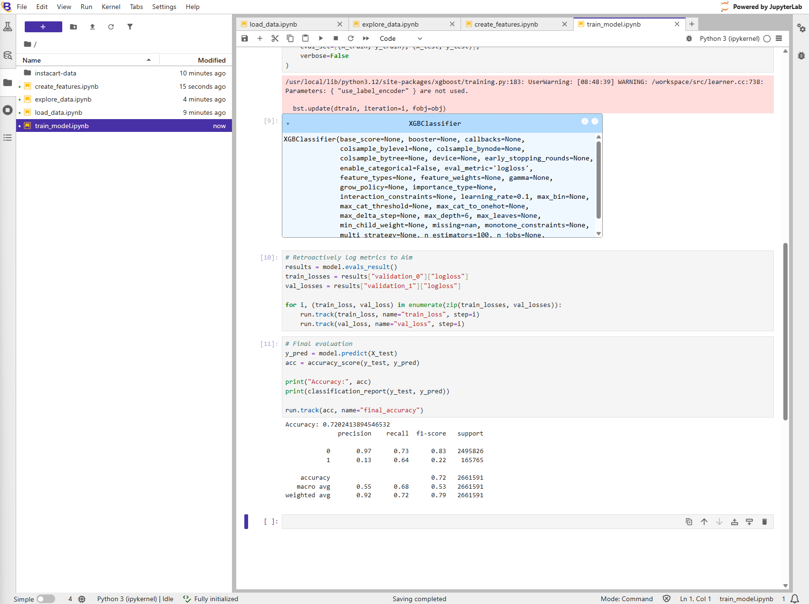
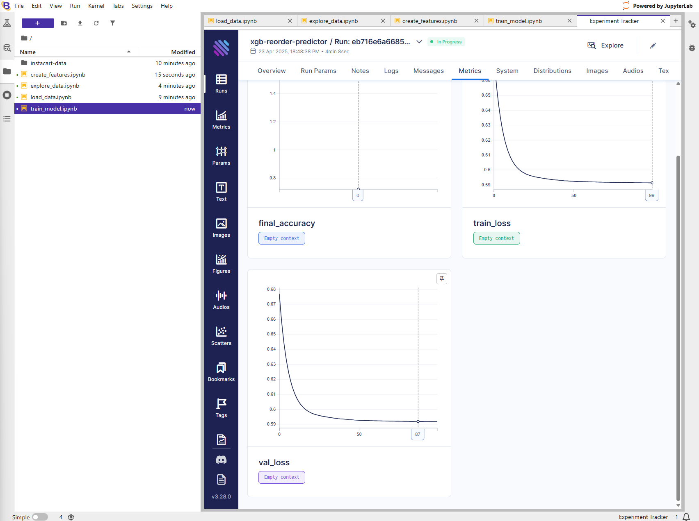

# Instacart Example Walkthrough

This example explores the [Kaggle Instacart](https://www.kaggle.com/datasets/yasserh/instacart-online-grocery-basket-analysis-dataset) prediction problem. This walkthrough covers:

- Data loading
- Lazily executed data transformations
- Reading/writing Delta Tables
- Model training
- Model experiment tracking and evaluation
- Delta Explorer and Experiment Tracker

## Setting up
Firstly, follow the [Quickstart](../README.md#-quickstart)

Next, drag and drop the contents of `assets/examples/example-instacart/` into the File Browser:

## Follow-along

### 1. Load data

Run all cells in the `load_data.ipynb` notebook.

A new folder, `instacart-data` should be created with six csvs inside.

The `orders` table should be displayed at the bottom of the notebook:

### 2. Explore data

Run all cells in the `explore_data.ipynb` notebook.

The `top_products` dataframe should be displayed at the bottom of the notebook:

### 3. Create features

Run all cells in the `create_features.ipynb` notebook.

The newly created Delta Table, `final_features`, should be visible in the Delta Explorer:

### 4. Train model

Run all cells in the `train_model.ipynb` notebook. This may take a few minutes.

The classification matrix should be printed at the bottom of the notebook:

### 5. Inspect experiment

Click on the Experiment Tracker button (conical flask icon) at the top of the left sidebar. The Experiment Tracker should be opened in a new tab. 

Click on "Runs" in the top left corner of the Experiment Tracker tab.
Click on the name of the first run (should be similar to `Run: eb716e6a66854516863724c3`.)
Click on "Metrics" in the top tool bar.

Multiple training iteration metrics should be visible:

